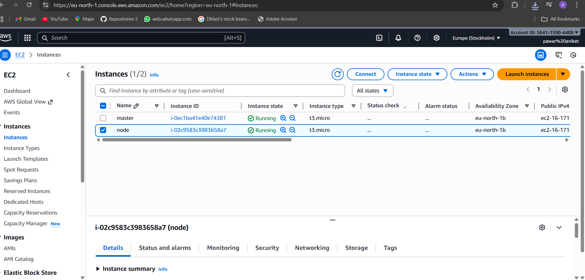
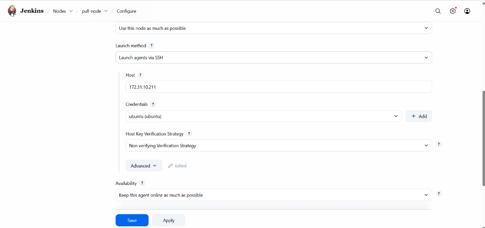
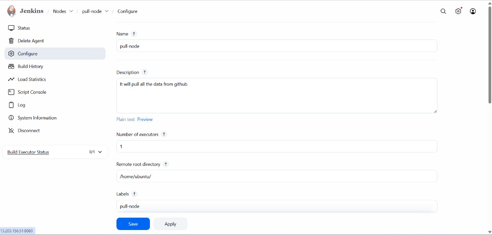
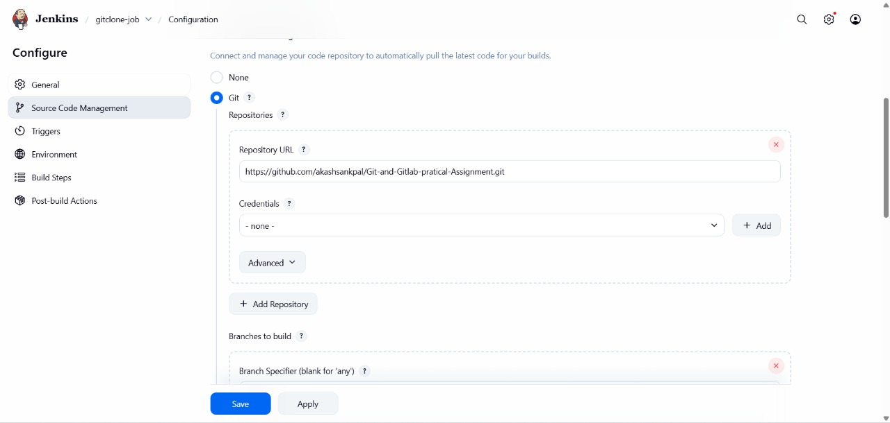
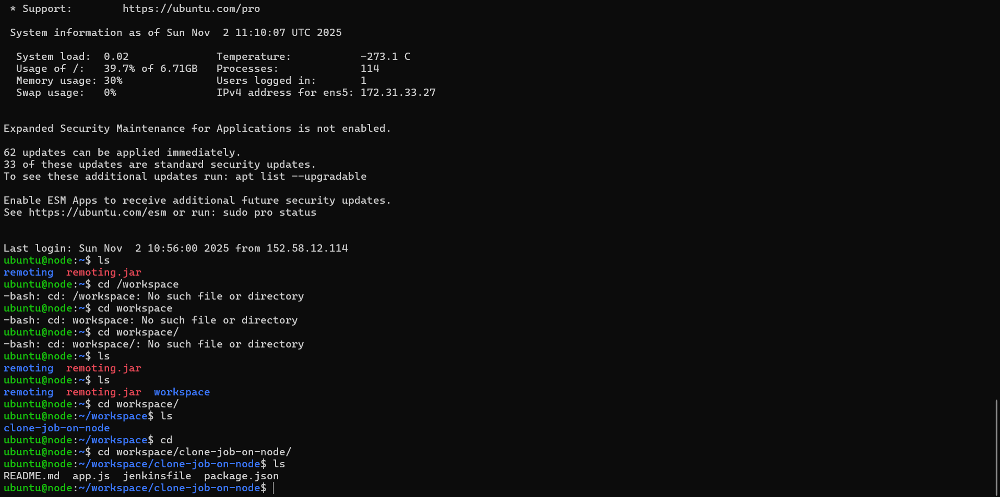

#  Architecture of jenkins
## 📘 Project Overview

This project demonstrates a Jenkins CI/CD pipeline for automating the build, test, and deployment process of a Node.js application.
The setup includes integration with GitHub, Docker, and AWS EC2, enabling a fully automated deployment workflow.

## ☁️ AWS EC2 Instance Setup

This section shows the AWS EC2 instance used for deploying the Node.js application through Jenkins.
The instance runs Docker and hosts the containerized application after successful deployment from Jenkins.

Instance Details:

Service: AWS EC2

OS: Ubuntu 22.04 LTS

Type: t2.micro (Free-tier)

Purpose: Host Docker container for Node.js app

Connectivity: Configured via SSH for Jenkins deployment

Screenshot:

## 🔹 Jenkins Node (pull-node) Configuration Summary

Node Name: pull-node
Description: It will pull all the data from GitHub
Executors: 1
Remote Root Directory: /home/ubuntu/
Label: pull-node
Purpose: To connect remote Ubuntu server with Jenkins master and pull GitHub repo code for deployment/build.

## 🧩 Step-by-Step Explanation

Go to Jenkins → Manage Jenkins → Nodes → New Node

Enter Node name: pull-node

Select Permanent Agent → OK

### Configure fields:

1)Description: “It will pull all the data from GitHub”

2)Remote root directory: /home/ubuntu/

3)Labels: pull-node (for job binding)

4)Number of Executors: 1

### Save & Apply

Connect agent using SSH (Jenkins Master → Remote Node)

Test connection to verify the node is active.

## 🔹 Jenkins Node (pull-node) — Configuration Overview

Node Name: pull-node

Launch Method: Launch agents via SSH

Host IP: 172.31.10.211

Credentials: ubuntu (SSH user)

Host Key Verification Strategy: Non-verifying (for test/dev setup)

Availability: Keep this agent online as much as possible.

 Remote Directory: /home/ubuntu/

Label: pull-node

Description: It will pull all the data from GitHub

### 🧩 Step-by-Step Setup Explanation

1)Go to Jenkins Dashboard → Manage Jenkins → Nodes → New Node

2)Enter Node name: pull-node → Select Permanent Agent → Click OK

3)Fill the following fields:

Description: “It will pull all the data from GitHub”

of executors: 1

Remote root directory: /home/ubuntu/

Labels: pull-node
Usage: “Use this node as much as possible”

4)Launch method: Launch agents via SSH

Host: 172.31.10.211

Credentials: add Ubuntu SSH key

Host Key Verification Strategy: Non verifying (for easier first-time setup)

5)Availability: “Keep this agent online as much as possible”

6)Click Save → Jenkins will connect this node via SSH.

## 🔹 Jenkins Job: gitclone-job Configuration Summary

Job Name: gitclone-job
Purpose: Automatically pull (clone) source code from GitHub repository.
Repository URL: https://github.com/vikasmane18/architecture-_of_jenkins_project

Branch to Build: main (default if blank)

Credentials: none (public repo used)

SCM: Git

### 🧩 Step-by-Step Jenkins Git Integration Setup

Go to Jenkins Dashboard → New Item → Freestyle project

Name it: gitclone-job

Click OK → Open configuration screen.

Under Source Code Management → Select Git

Repository URL: https://github.com/vikasmane18/architecture-_of_jenkins_project

Credentials: Keep blank (if public repo) or add GitHub credentials if private.

Branch Specifier: */main (or leave blank for any)

Under Build Steps → Add Build Step → Execute Shell

Example commands:

cd /var/lib/jenkins/workspace/

gitclone-job

ls

npm install

Click Save → Build Now
Jenkins will automatically clone the GitHub repo into the workspace and execute the build commands.

## 🔹 Jenkins Job Summary — gitclone-job

Job Name: gitclone-job
Description: It will clone the GitHub code

Status: ✅ Build #1 (Success)
Build Trigger Time: 10:30 AM

Type: Freestyle project

Repository Used:
https://github.com/vikasmane18/architecture-_of_jenkins_project

Workspace Path: /var/lib/jenkins/workspace/gitclone-job

## 🧩 Working Explanation

Created Freestyle Project: gitclone-job

Added description: “It will clone the GitHub code”

In Source Code Management, selected Git

Added GitHub repo URL

Saved configuration

Clicked Build Now

Jenkins pulled the repository from GitHub and stored it in the workspace

Verified successful build under “Build #1”

## Explanation of Jenkins Node and Job Execution

### Step By Step Execution

✅ 1. SSH Connection Active

The Jenkins node (IP: 172.31.33.27) successfully connected to the Jenkins master.
This allows the Jenkins master to execute jobs remotely on the Ubuntu node.

📦 2. Jenkins Agent Running

The remoting.jar file is the Jenkins agent, which enables communication between the Jenkins master and the agent node.
This ensures that build instructions from Jenkins master are properly executed on the remote node.

📁 3. Workspace Folder Created

Jenkins automatically created the workspace directory at:

/home/ubuntu/workspace/

This directory will store all the cloned project files and build outputs.

📂 4. Git Clone Job Executed

The Jenkins job clone-job-on-node ran successfully, cloning the GitHub repository into the workspace:

/home/ubuntu/workspace/clone-job-on-node/

README.md

app.js

jenkinsfile

package.json

This confirms that the repository has been pulled successfully onto the remote node.

## Summary:

 Jenkins Node and GitHub Integration

A Jenkins agent (pull-node) was configured on a remote Ubuntu server (172.31.33.27) using SSH to enable distributed builds. The Jenkins master successfully connected to the node, and the agent (remoting.jar) ensured seamless communication between master and node.

A workspace directory (/home/ubuntu/workspace/clone-job-on-node/) was automatically created on the node. The Jenkins job clone-job-on-node was executed, which cloned the GitHub repository into the workspace. The project files (README.md, app.js, jenkinsfile, package.json) were verified, confirming that the repository was pulled successfully.

This setup enables automated CI/CD workflows with remote execution, GitHub integration, and centralized build management, forming the foundation for Node.js deployment pipelines.